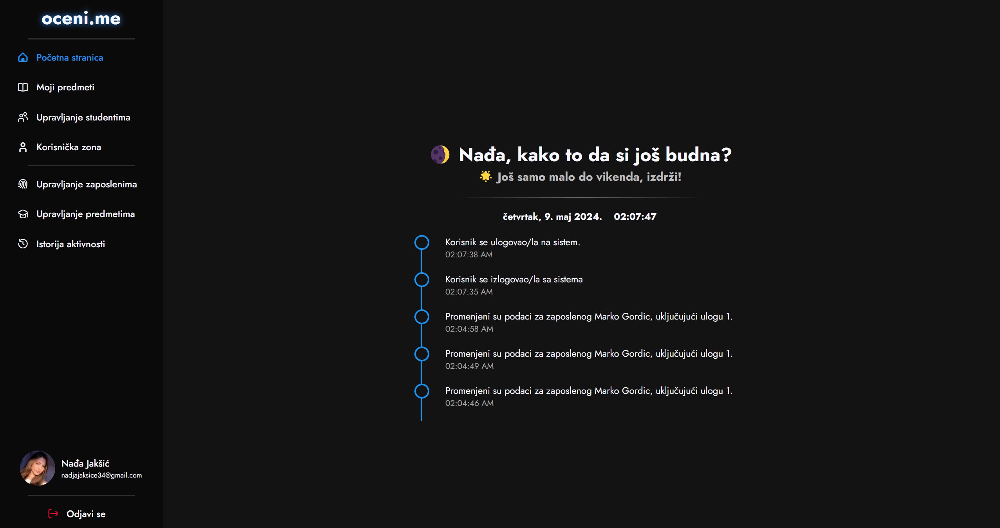

# 

#  OCENI.ME

**OCENI.ME** je studentski projekat za **Fakultet Tehničkih Nauka u Novom Sadu**. Cilj aplikacije je pojednostavljeno i ubrzano pregledanje studentskih radova radi veće efikasnosti i bezbednosti asistenata i njihovih uređaja.

Aplikacija omogućava **brzo, efikasno i pre svega bezbedno** testiranje studentskih kodova u okviru **ograničenog Docker okruženja**. Na taj način pregledanje i ocenjivanje postaju brži, a ujedno se sprečava pokretanje potencijalno nestabilnih ili malicioznih kodova na ličnim računarima zaposlenih.

## 💙 Posebno priznanje

Ovaj projekat mi je veoma drag, jer verujem da će pomoći kako mnogim asistentima tako i studentima. Želeo bih **posebno da se zahvalim** jednoj meni veoma posebnoj osobi koja je moja najveća motivacija za sve stvari u životu i bez koje ovaj projekat ne bi bio to što jeste. Takve osobe su nezamenljive, i ukoliko ih pronađete, čuvajte ih. Hvala ti, N. 💙

# 💻 Tehnologije

Aplikacija je razvijena uz sledeće tehnologije:

    
    
    
    
    
    
    
    
    
    
    
  

# 🚀 Pokretanje aplikacije

Aplikacija je dostupna za Windows i Linux operativne sisteme. Može se pokrenuti pomoću Docker tehnologije ili manuelno. Za ručno pokretanje, potrebne su sledeće komponente:

1. **Node.js**  
2. **React**  
3. **MySQL Server**  
4. **Docker**  
5. **npm**

Po pokretanju, korisnik treba uneti lične podatke radi konfiguracije svog naloga. Nakon prijave, otvara se korisnički interfejs.

# 📑 Stranice i funkcionalnosti

## 🏠 Početna stranica

Na početnoj stranici korisnik može videti vremensku liniju i poslednjih pet aktivnosti koje su izvršene na trenutnoj instanci.

## 📚 Moji predmeti

Otvaranjem stranice **Moji predmeti**, korisnik može pregledati spisak svih predmeta kojima ima pristup, bez obzira na ulogu (profesor, asistent ili demonstrator).

## 👩‍🎓 Upravljanje studentima

Na stranici **Upravljanje studentima** korisniku je omogućen pregled, pretraga, brisanje i izmena postojećih studenata, kao i dodavanje novih popunjavanjem forme sa parametrima poput imena, prezimena, broja indeksa i e-mail adrese.

## 🛠️ Korisnička zona

Na stranici **Korisnička zona** korisnik može izmeniti trenutno vidljive parametre i lozinku svog naloga.

## 👨‍💼 Upravljanje zaposlenima

Stranica **Upravljanje zaposlenima** pruža pregled svih unetih zaposlenih, kao i opcije pretrage, brisanja, izmene i dodavanja novih popunjavanjem forme sa odgovarajućim parametrima. Moguće pozicije uključuju dekana, profesora, asistenta i demonstratora.

## 🏫 Upravljanje predmetima

Na stranici **Upravljanje predmetima** moguće je pretražiti i izmeniti postojeće predmete, kao i dodati nove popunjavanjem forme sa parametrima predmeta. Pri dodavanju novog predmeta, unosi se i odgovarajući profesor pod uslovom da već postoji u sekciji *Upravljanje zaposlenima*.

## 🕰️ Istorija aktivnosti

Stranica **Istorija aktivnosti** automatski prikazuje sve aktivnosti koje su izvršene u sistemu i aplikaciji u tabelarnom formatu. Korisnik može videti tip aktivnosti (informacija, upozorenje, greška).

# 🔍 Stranice predmeta i njihove funkcionalnosti

Klikom na određeni predmet na stranici *Moji predmeti*, u navigacionom meniju pojavljuju se dodatne funkcionalnosti vezane za predmet, kao što su kreiranje kolokvijuma, spisak studenata, kreiranje konfiguracije i automatsko testiranje.

## 🛠️ Kreiraj konfiguraciju

Stranica **Kreiraj konfiguraciju** prvi je korak za pripremu automatskog testiranja. Korisnik može da:

- Unese naziv konfiguracije
- Odabere redni broj kolokvijuma
- Prevlači .ZIP datoteku sa test primerima
- Dodeli bodove za svaki primer
- Dodaje .ZIP datoteku sa rešenjem zadatka

## 📝 Novi kolokvijum

Stranica **Novi kolokvijum** drugi je korak u pripremi automatskog testiranja. Na ovoj stranici korisnik treba da:

- Prevlači .json datoteku
- Prevlači .TAR datoteku

Time se omogućava automatsko testiranje i registracija studenata na platformu.

## ⚙️ Konfiguracije

Stranica **Konfiguracije** pruža pregled svih konfiguracija sa opcijama za:

- Brisanje
- Preuzimanje
- Učitavanje dodatnih informacija

## 🏷️ Kolokvijumi

Stranica **Kolokvijumi** pruža korisniku listing svih postojećih kolokvijuma uz informacije o njima. Korisnik može:

- Obrisati kolokvijum
- Pristupiti stranici za automatsko testiranje

## 📋 Automatsko testiranje

Na stranici automatskog testiranja, korisnik može:

- Videti listing studenata koji su radili određeni kolokvijum
- Pokrenuti automatsko testiranje svih studenata
- Osvežiti prikaz bodova nakon testiranja
- Generisati ACS izveštaj u PDF formatu

Testiranje je moguće i za svakog studenta pojedinačno, a dostupne su i opcije ručnog ocenjivanja, testiranja i pregleda koda.

## 🛠️ Ručni pregled koda

Na stranici za ručni pregled koda, korisnik može:

- Videti originalni kod
- Debug-ovati kod koristeći debugger i kompajler
- Dodati varijacije koda bez izmene originalnog koda
- Ručno izmeniti bodove za svaki automatski test

## 📋 Spisak studenata

Stranica **Spisak studenata** pruža tabelarni pregled svih studenata određenog predmeta sa osnovnim informacijama.

## 🛠️ Upravljanje predmetom

Stranica **Upravljanje predmetom** omogućava korisniku upravljanje opštim parametrima o predmetu i dodavanje novih ili uklanjanje postojećih zaposlenih. Klikom na "Napusti predmet," korisnik se vraća na početni interfejs aplikacije.

# 👥 Autori i priznanja

+ [Marko Gordić](https://github.com/MarkoGordic) - Autor  
+ [Radovan Turović]() - Inicijator projekta  
+ [Sara Poparić]() - Pomoć pri realizaciji aplikacije  

# 📜 Licenca

Projekat je zaštićen pod [MIT](https://choosealicense.com/licenses/mit/) licencom.
