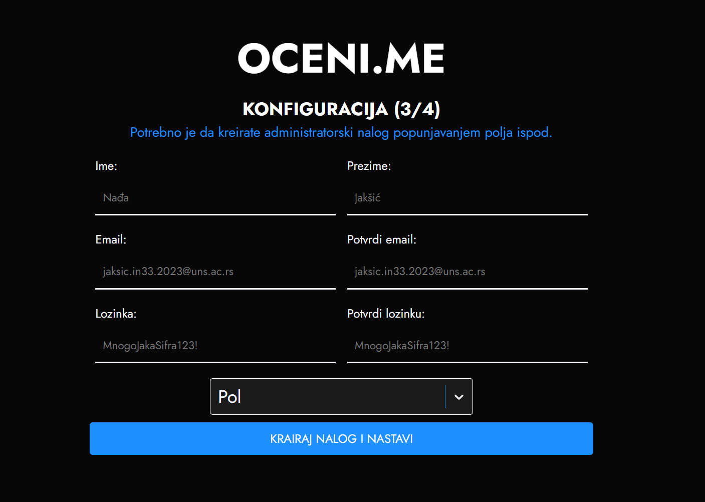
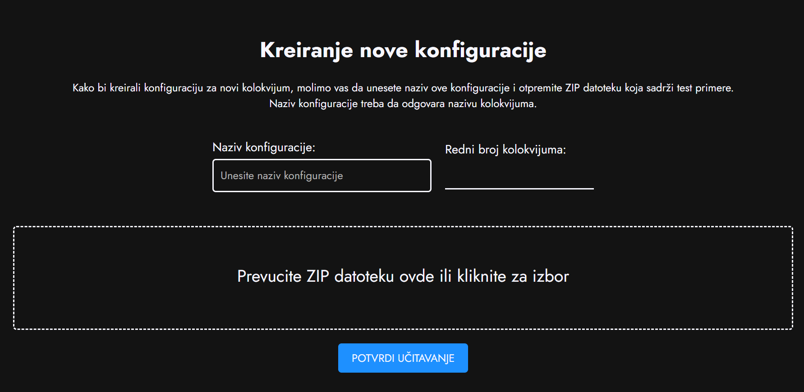
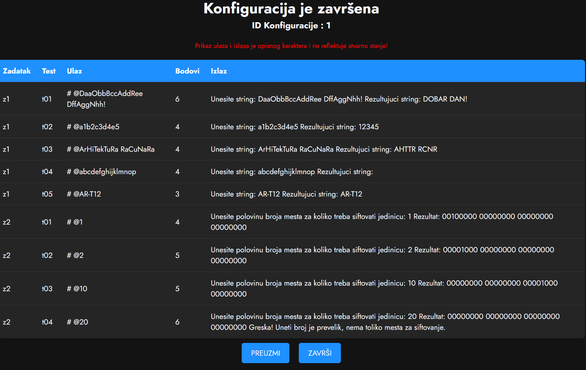
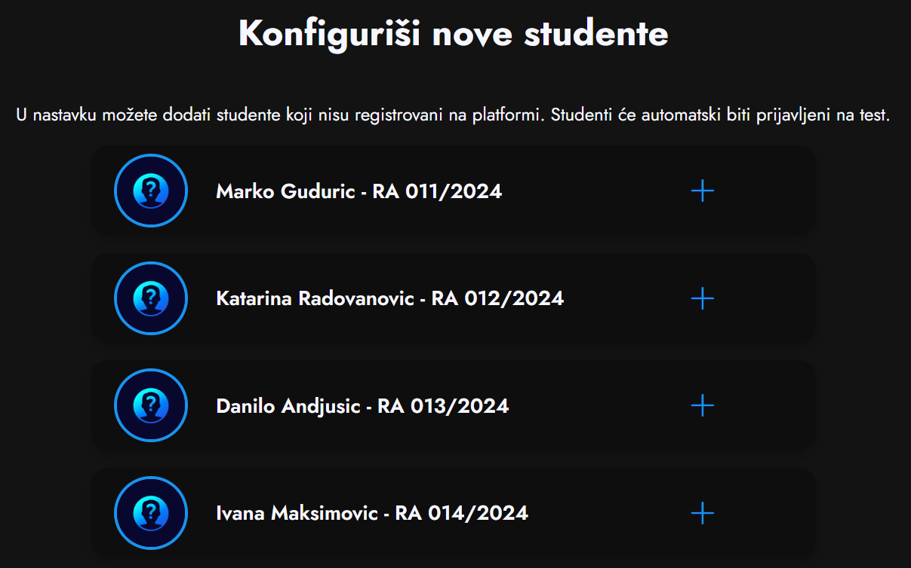
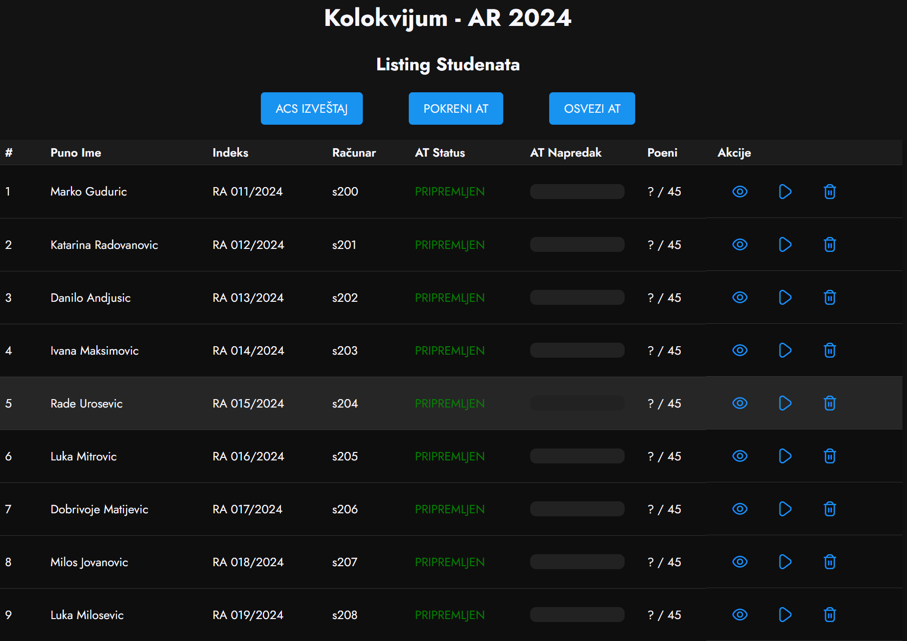
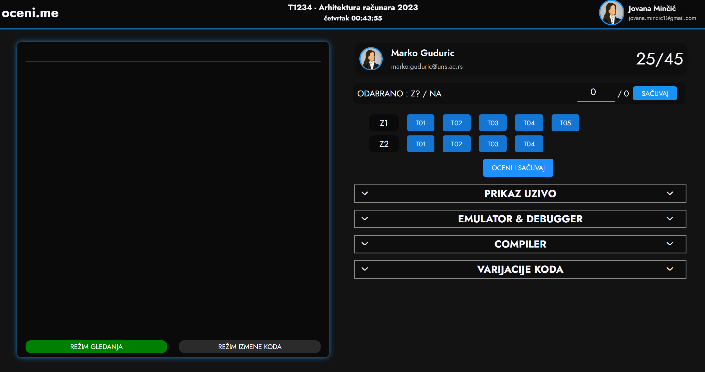
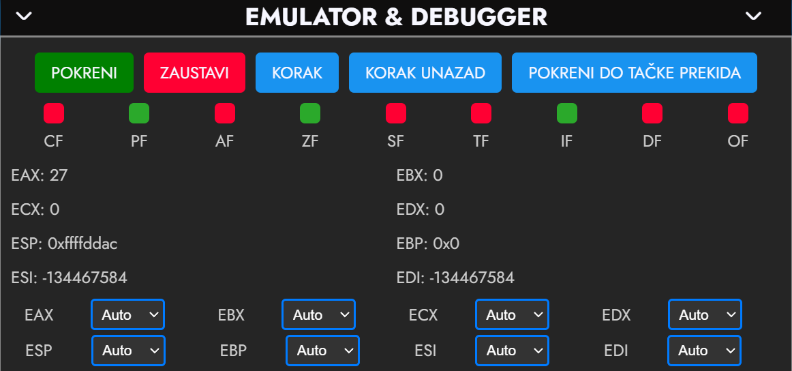
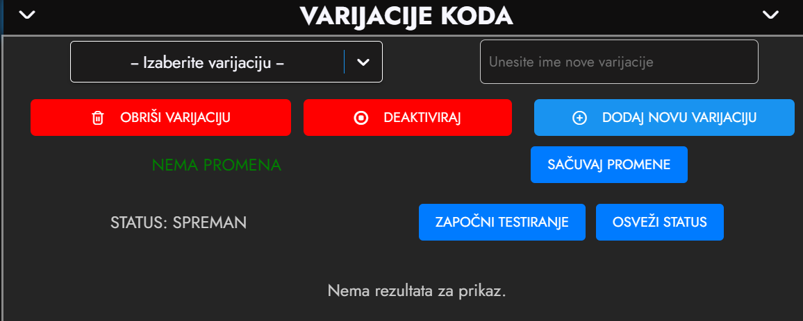
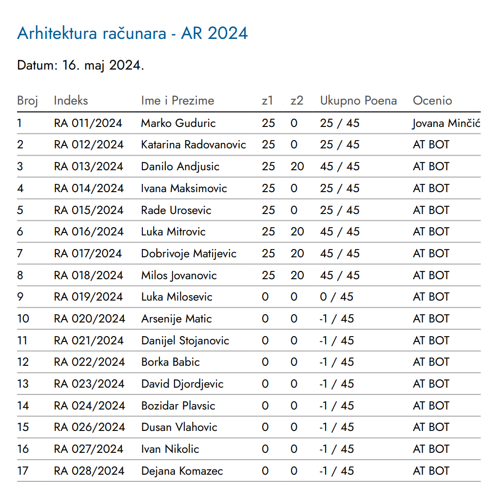

# Tehnička dokumentacija za **OCENI.ME** 📚💻

OCENI.ME je studentski projekat za *Fakultet Tehničkih Nauka* u Novom Sadu. Cilj aplikacije je pojednostavljeno i ubrzano pregledanje studentskih radova radi veće efikasnosti i bezbednosti asistenata i njihovih uređaja.

# 
Aplikacija omogućava brzo, efikasno i pre svega bezbedno testiranje studentskih kodova u okviru ograničenog Docker okruženja. Na taj način pregledanje i ocenjivanje postaju brži, a ujedno se sprečava pokretanje potencijalno nestabilnih ili malicioznih kodova na ličnim računarima zaposlenih.

# Uputstvo za korišćenje aplikacije
## Inicijalno pokretanje aplikacije 🚀
Na samom početku aplikacije otvara se prvi prozor na kome korisnik dobija uputstva za nameštanje **.env** parametara.  
Nadalje neophodno je pratiti sledeće korake:

- Potrebno je da otvorite vaš Docker koji pokreće backend server.
- Kada pristupite Docker-u, potrebno je postaviti sledeće .ENV parametre:

  - **MAX_DOCKER_CONTAINERS** - Maksimalan broj konkurentnih Docker instanci prilikom testiranja 
  - **SESSION_SECRET** - Tajna koju će server koristiti za enkripciju korisničkih sesija
  - **DB_USER** - Vaše korisničko ime u MySQL bazi
  - **DB_PASSWORD**- Lozinka za korisnički nalog u MySQL bazi
  - **DB_HOST** - URL na kom se hostuje MySQL baza
  - **DB_DATABASE** - Ime baze koja će biti korišćena za potrebe ove OCENI.ME instance

- Kada podesite .ENV fajl, restartujte backend instancu i kliknite **NASTAVI!**  

Nakon toga otvara se drugi prozor na kome se nalazi formular za kreiranje administratorskog naloga **koji se obavezno mora popuniti.**  

Kada popunite formular, otvara se prozor za prijavu, na kome je potrebno prijaviti se sa prethodno unetim podacima.

## Kreiranje novog predmeta 📚
Sa leve strane nalazi se navigacioni meni i da bismo kreirali novi predmet, kliknemo na polje **Upravljanje predmetima**.

Potom kliknemo na dugme **Dodaj Predmet**, nakon čega se otvara modal na kom je potrebno popuniti neophodne podatke o samom predmetu:

  

Nakon pravljenja novog predmeta, na meniju potrebno je odabrati **Moji predmeti**. Na ovoj stranici odaberite željeni predmet.  
Kada izaberete predmet koji želite, navigacioni meni sa leve strane će se ažurirati.

## Kreiranje konfiguracije ⚙️
Na stranici **Kreiraj konfiguraciju** neophodno je napisati naziv konfiguracije i redni broj kolokvijuma.

  

U označeni kontejner potrebno je prevući **zip** arhivu koja ima sledeću strukturu:  

- Posebne foldere za svaki zadatak (nazvati ih redom z1, z2... do maksimalno 9 zadataka)
- U svakom folderu potrebno je ubaciti test primere za specifičan zadatak (nazvati ih redom t01, t02...do maksimalno 99 test primera)

Nakon prevlačenja **zip** arhive, dodeljujemo bodove za svaki zadatak i test-primer pojedinačno:

 

**Napomena: Ukupan broj bodova na svim test primerima mora biti jednak broju bodova na kolokvijumu!**

Sada je potrebno prevući **zip** arhivu koja sadrži rešenje zadataka i ima sledeću strukturu:  
- Posebne foldere za rešenja svakog zadatka (nazvati ih redom z1r, z2r...)
- U svakom folderu mora postojati z(redni broj zadatka).S fajl i glavni.c (ukoliko je neophodan)

Ukoliko smo pravilno uneli konfiguraciju možemo je preuzeti na naš računar, a možemo i kliknuti na **Završi** i tada je ona vidljiva na stranici **Konfiguracije**. Tu je možemo pregledati, preuzeti ili obrisati.  

**Napomena: Kada preuzmemo zip sa konfiguracijom, u njemu dobijamo foldere sa svakim zadatkom pojedinačno, njegovim rešenjima, kao i config.json fajlom.**

## Kreiranje novog kolokvijuma 📝
Klikom na **Novi kolokvijum** otvaramo stranicu za dodavanje novog kolokvijuma. U označenom kontejneru treba prevući .json konfiguracionu datoteku koju smo preuzeli prethodno. Nakon toga prevučemo i TAR arhivu (koju asistent dobija od strane administratora).    

Na novoj stranici imamo mogućnost da dodamo sve studente koje prethodno nisu bili dodati u OCENI.ME bazu (možemo dodati svakog studenta pojedinačno, a možemo ih dodati sve odjednom klikom na dugme **Dodaj sve**).  

 

Kada dodamo studente koje želimo, dobijamo tabelarni prikaz svih studenata koji su evidentirani da su radili kolokvijum. Klikom na dugme **Kreiraj kolokvijum** kolokvijum postaje vidljiv i možemo ga pregledati ili obrisati.

## Automatsko testiranje ⚙️🤖
Klikom na **Pregled kolokvijuma** dobijamo listing studenata sa mogućnostima manuelnog pregledanja, automatskog testiranja i brisanja rada studenta.

Dugme **Pokreni AT** omogućava pokretanje automatskog testiranja za sve studente. Nakon završetka automatskog testiranja neophodno je kliknuti na **Osveži AT** da bismo osvežili napredak testiranja za sve studente.  

U odeljku akcije kada pritisnemo na simbol oka otvara se stranica za manuelno pregledanje studentskog rada.  

   

Sa desne strane možemo manuelno izmeniti bodove za određeni test primer. Takođe tu imamo i četiri opcije:  
- **Prikaz uživo**  
    - U ovom tabu možemo videti opis i objašnjenje svake instrukcije kada kod pokrenemo u debugger-u
- **Emulator i debugger**
    - Ovde se nalaze sve kontrole, stanja registra i flegovi  
    

   
- **Compiler**
    - Sa desne strane se nalazi izlazni kod GDB-a, programa i očekivani izlazni kod, sa leve strane se ispisuje greška
- **Varijacije koda**
    - U ovom tabu možemo ili izabrati već postojeću varijaciju ili dodati novu
    - Kada izaberemo željenu varijaciju prelazimo na režim izmene koda
    - U režimu izmene koda možemo menjati izvorni kod i takođe ga automatski testirati
    - Nakon završetka izmene koda možemo sačuvati promene i time promeniti izvorni kod
    - Takođe možemo obrisati varijaciju i deaktivirati je i time ne promeniti izvorni kod

    

  

Kada završimo sa manuelnim ocenjivanjem, treba da sačuvamo izmene.  
Povratkom na listing studenata i klikom na **ACS Izveštaj** dobijamo PDF fajl sa indeksima, imenima i prezimenima studenata, ukupnim bodovima i imenom asistenta koji je manuelno ocenjivao rad.

